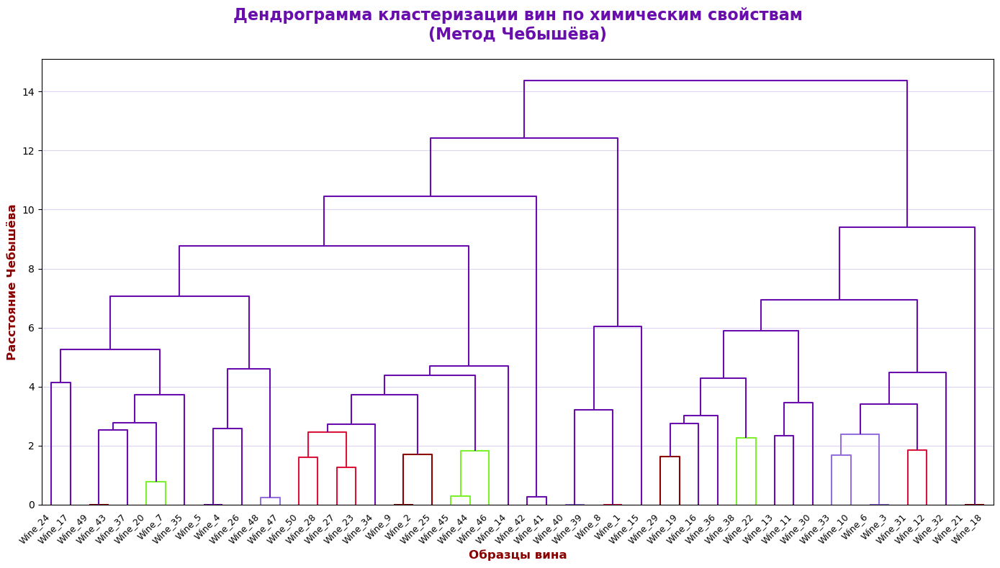
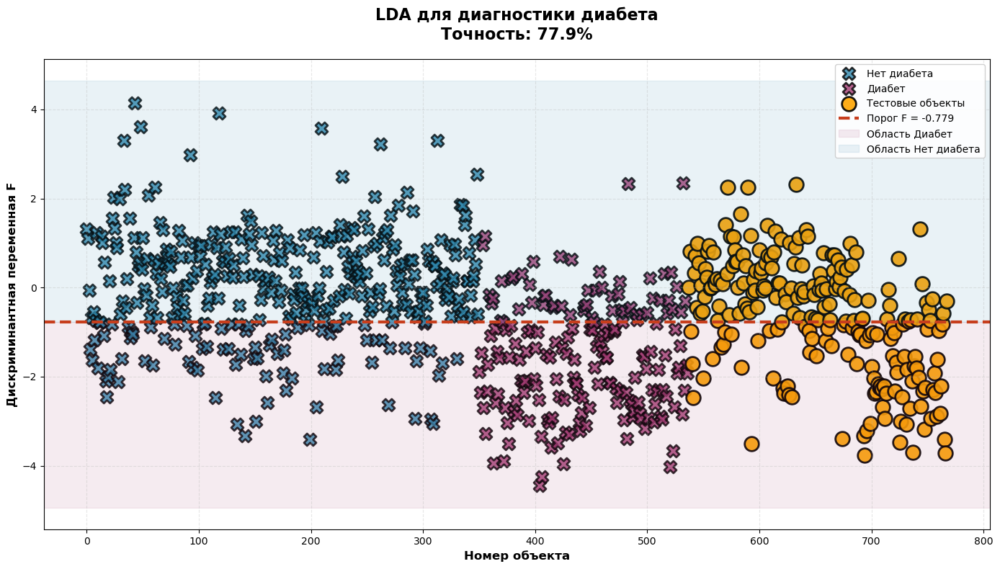
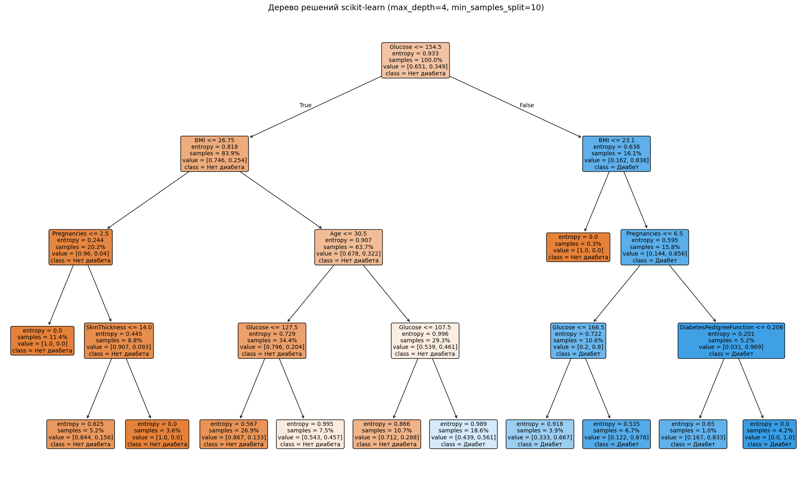
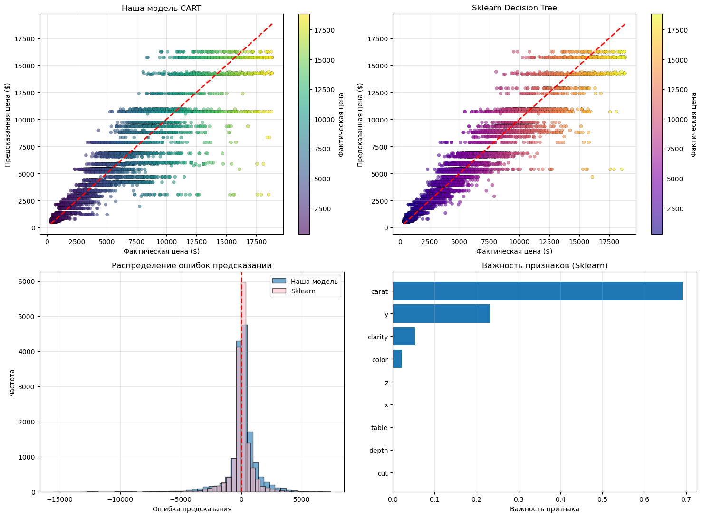

# Machine Learning Labs

Lab work from the **Machine Learning and Statistics** course (3rd year, semester 5) at Don State Technical University (DSTU).
The focus is on implementing classic algorithms **from scratch** with NumPy and pandas and then comparing them with scikit-learn on real datasets.

| Lab | Topic | Implemented from scratch | Key result |
|---|---|---|---|
| [1](lab1-hierarchical-clustering) | Hierarchical clustering | Agglomerative clustering with the Chebyshev distance, dendrograms, 3D cluster plots | Clusters of regions (industry, consumer spending) and wines by chemical properties |
| [2](lab2-discriminant-analysis) | Linear discriminant analysis | LDA: covariance matrices, discriminant function, decision threshold | Diabetes diagnosis: **77.9%** accuracy (scikit-learn: 78.8%) |
| [3](lab3-decision-trees) | Decision trees | Classification tree (`Tree`, `Node`) compared with `DecisionTreeClassifier` | Wine quality and diabetes classification, tree visualisation |
| [4](lab4-association-rules) | Association rules | **Apriori** and **FP-Growth** (FP-tree, conditional pattern bases) | Market basket analysis on 7,500 transactions, rules with lift up to 25 |
| [5](lab5-cart-regression) | Regression trees | **CART regressor** (`CARTRegressor`, best-split search by MSE) | Diamond price prediction: **R² = 0.894**, MAE = $727 (scikit-learn: R² = 0.945; mean baseline MAE = $3,017) |
| [Extra](extra-wine-quality-classification) | Ensembles and SVM | – | Wine quality: Random Forest **84.9%** accuracy vs SVM 68.0%; PCA, grid search. This is a copy of the final notebook from my course project; the full project is in [wine-quality-course-project](https://github.com/MP4-Player/wine-quality-course-project) |

## Highlights

**Hierarchical clustering of wines (Chebyshev distance)**



**LDA for diabetes diagnosis, own implementation (77.9% accuracy)**



**Decision tree**



**CART regression: predicted vs actual diamond prices**



## Datasets

| Dataset | Used in |
|---|---|
| Wine Quality (UCI) | Labs 1–3, extra |
| Pima Indians Diabetes | Labs 2–3 |
| Market Basket Optimisation | Lab 4 |
| Diamonds | Lab 5 |

The datasets are included next to the notebooks. Some notebooks load files by absolute paths from my machine; change the path to the local CSV file before running. The extra wine notebook also expects `winequality-red.csv`; the complete dataset is included in [wine-quality-course-project](https://github.com/MP4-Player/wine-quality-course-project).

## How to run

```bash
pip install numpy pandas scipy scikit-learn matplotlib seaborn jupyter
jupyter notebook
```

## Tech stack

Python · NumPy · pandas · SciPy · scikit-learn · Matplotlib · seaborn

## License

[MIT](LICENSE)
